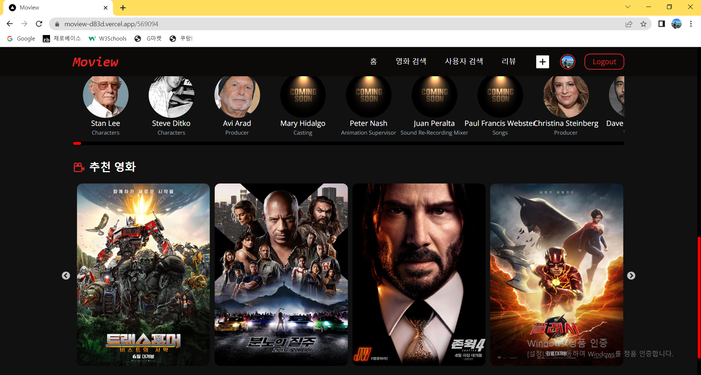
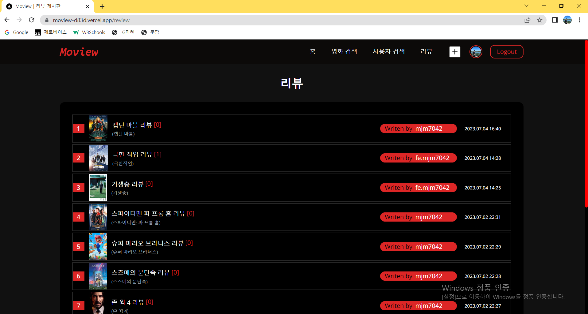
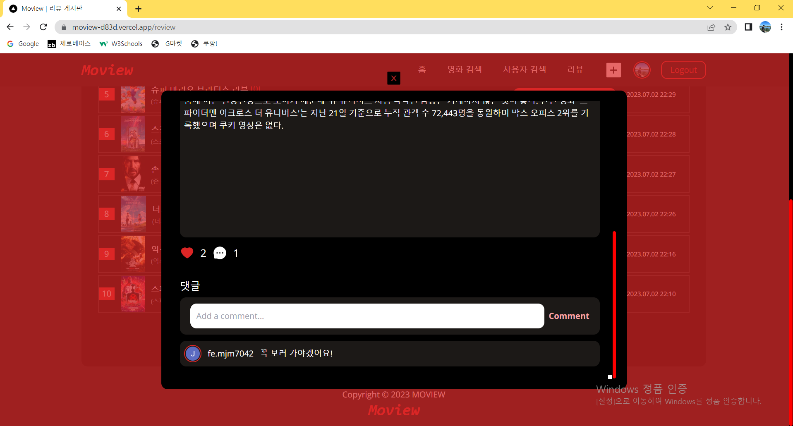
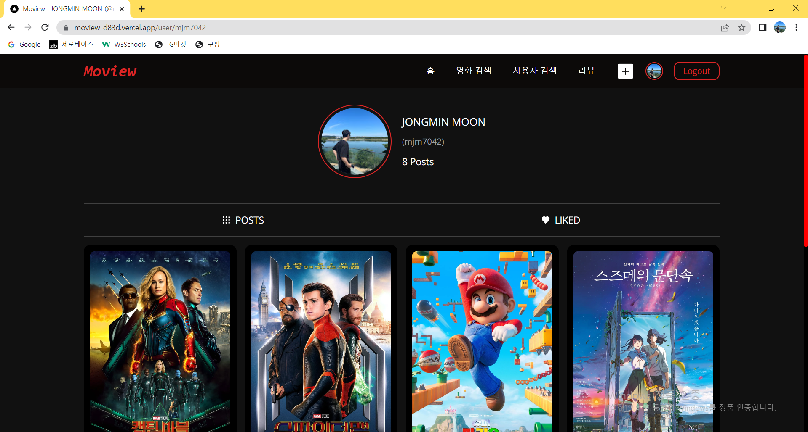

# Moview

---

### 🎬 영화 정보 검색 및 리뷰 커뮤니티 웹 서비스

- 영화를 보기 전에 재미가 있는지, 반응이 어떤지 찾아보고 싶지만 신뢰성이 떨어지는 포털사이트 리뷰를 접하기 쉽습니다.
  Moview는 영화 정보, 개봉 예정 영화, 현재 핫한 영화 등을 쉽게 찾아볼 수 있도록 만들었습니다!
  또한, 해당 영화에 대한 리뷰를 작성할 수 있고 좋아요를 많이 받았다면 신뢰도가 높은 리뷰입니다.
  영화를 좋아하는 한 사람으로서 기본적인 영화 정보를 찾고, 신뢰도가 높은 리뷰들을 볼 수 있도록 Moview 서비스를 만들어보았습니다.
- ### [배포 링크](https://moview-d83d.vercel.app/)

---

### 💿 주요 기술

- Next.js
- TypeScript
- Tailwind CSS
- SWR 상태 관리 라이브러리
- Axios : 비동기 통신을 위해 사용
- Sanity : 유저 / 게시물 / 좋아요 / 댓글 등의 데이터베이스

### 💿 API

- TMDB API

### 💿 주요 기능

- 현재 핫한 영화 / 개봉 예정 영화 확인
  

- 영화 / 유저 정보 검색

  - 검색어 자동완성 (검색어 입력 시 Debounce 훅을 통한 성능 최적화)
  - 키워드가 포함되어 있는 영화 / 유저 리스트 나열
    

- 영화 상세 정보

  - 포스터 클릭 시 해당 영화 상세 페이지 이동 (Link 컴포넌트를 통한 매끄러운 페이지 이동)
  - 기본 정보, 별점, 장르, 출연진, 연출진 등 확인
  - 해당 영화 id 값을 통해 관련된 영화 추천
    
    

- 로그인 / 회원가입 : 구글 계정으로 회원가입 시 sanity 유저 데이터베이스에 회원 정보 저장

- 리뷰 커뮤니티

  - 회원 정보가 있을 시 영화를 검색하고 선택해 이미지와 텍스트 입력을 통해 게시물 작성
  - 해당 게시물 댓글 / 좋아요 기능을 통해 게시물 신뢰도 확인
    
    

- 유저 프로필 페이지
  - 유저 아바타 클릭 시 프로필 페이지로 이동
  - 유저가 유저 정보 / 작성한 리뷰 개수 / 작성한 리뷰 리스트 / 좋아요한 리뷰 리스트 확인
    
